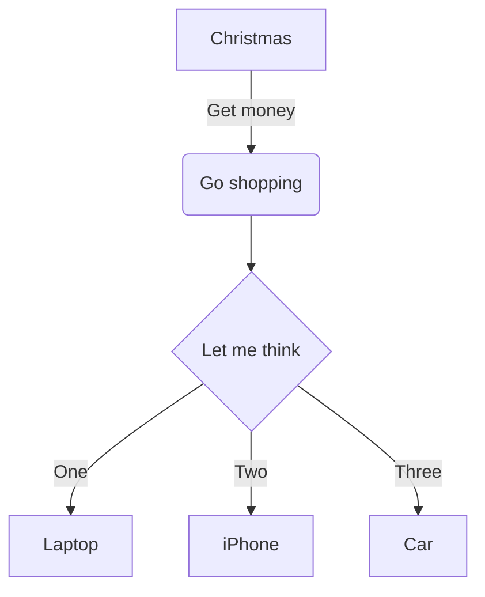
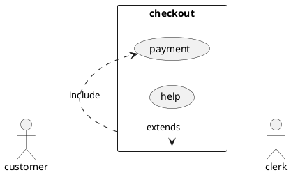

# Markdown

A *file* with **Markdown** content.

## With code blocks

```js
let a = 'a string value';

for (let char of a) {
    console.log(char);
}
```

```sql
SELECT * FROM table;
```

```
No language in this block
```

```sh
```

## With images

### Local


### Remote


### No content


### Unsafe path traversal


## With Mermaid graph



## With PlantUML graph



## External Link

[Google](https://google.com)

## Internal Link

[Other Page](other-page.md)
